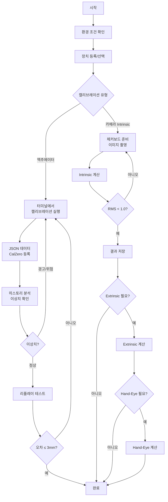

# CalZero 캘리브레이션 절차서

| 항목 | 내용 |
|------|------|
| **문서 번호** | CZ-PROC-001 |
| **버전** | 1.0 |
| **작성일** | 2026-02-20 |
| **적용 시스템** | CalZero v0.3.0 |
| **관련 문서** | [기준정의서 (CZ-STD-001)](./CALIBRATION_STANDARDS.md) |

---

## 목차

- [1. 개요](#1-개요)
- [2. 사전 준비](#2-사전-준비)
- [3. 장치 등록 절차](#3-장치-등록-절차)
- [4. 액추에이터 캘리브레이션 절차](#4-액추에이터-캘리브레이션-절차)
- [5. 카메라 Intrinsic 캘리브레이션 절차](#5-카메라-intrinsic-캘리브레이션-절차)
- [6. 카메라 Extrinsic 캘리브레이션 절차](#6-카메라-extrinsic-캘리브레이션-절차)
- [7. Hand-Eye 캘리브레이션 절차](#7-hand-eye-캘리브레이션-절차)
- [8. 리플레이 정확도 테스트 절차](#8-리플레이-정확도-테스트-절차)
- [9. 학습 데이터 분석 절차](#9-학습-데이터-분석-절차)
- [10. 백업 및 유지보수 절차](#10-백업-및-유지보수-절차)
- [11. 트러블슈팅 가이드](#11-트러블슈팅-가이드)
- [12. 부록](#12-부록)

---

## 1. 개요

### 1.1 목적

본 절차서는 CalZero 시스템을 사용한 로봇 캘리브레이션 작업의 전체 프로세스를 표준화하고, 작업자가 일관된 품질의 캘리브레이션을 수행할 수 있도록 단계별 지침을 제공한다.

### 1.2 적용 범위

- **대상 로봇**: SO101 Follower/Leader, Alice M1, Robo1, Robo2
- **캘리브레이션 유형**: 액추에이터(모터/조인트), 카메라(Intrinsic/Extrinsic/Hand-Eye), 센서(향후)
- **대상 시스템**: CalZero v0.3.0 (FastAPI + React)

### 1.3 용어 정의

| 용어 | 설명 |
|------|------|
| **homing_offset** | 조인트의 홈(중립) 위치로부터의 오프셋 값 (모터 step 단위) |
| **range_min / range_max** | 조인트의 최소/최대 가동 범위 (모터 step 단위, 0~4095) |
| **RMS Error** | 재투영 오차의 Root Mean Square (pixel 단위) |
| **Reprojection Error** | 3D→2D 투영 시 실제 점과 예측 점 사이의 오차 |
| **Eye-in-Hand** | 카메라가 로봇 엔드이펙터에 장착된 구성 (wrist_cam) |
| **Eye-to-Hand** | 카메라가 외부에 고정된 구성 (front_cam) |
| **Intrinsic** | 카메라 내부 파라미터 (초점거리, 주점, 왜곡계수) |
| **Extrinsic** | 카메라 외부 파라미터 (회전, 이동 - 기준 좌표계 대비 위치) |
| **URDF** | Unified Robot Description Format (로봇 구조 기술 파일) |
| **σ (sigma)** | 표준편차. 데이터 분산 정도의 척도 |

### 1.4 관련 문서

- [CalZero 캘리브레이션 기준정의서 (CZ-STD-001)](./CALIBRATION_STANDARDS.md) — 품질 기준, 임계값, 데이터 스키마 정의

---

## 2. 사전 준비

### 2.1 환경 조건 확인

캘리브레이션 시작 전 아래 환경 조건을 확인한다. 상세 기준은 [기준정의서 2장](./CALIBRATION_STANDARDS.md#2-환경-기준)을 참조한다.

| 항목 | 조건 | 비고 |
|------|------|------|
| 실내 온도 | 18~25°C | 급격한 온도 변화 시 30분 안정화 대기 |
| 습도 | 40~60% RH | 결로 방지 |
| 진동 | 캘리브레이션 중 외부 진동 최소화 | 인접 장비 가동 중지 권장 |
| 조명 | 균일한 간접 조명 (카메라 캘리브레이션 시) | 직사광선, 점멸 조명 회피 |
| 로봇 상태 | 워밍업 완료 (전원 투입 후 5분 이상) | 모터 온도 안정화 |

### 2.2 필요 장비 및 소프트웨어

**하드웨어**:
- 대상 로봇 (SO101 등) 및 전원
- USB 케이블 / 네트워크 연결
- 체커보드 (A4 인쇄물, 평평한 보드에 부착)
- 카메라 (front_cam / wrist_cam)
- 버니어캘리퍼스 또는 정밀 자 (체커보드 실측용)

**소프트웨어**:
- CalZero 웹 앱 (프론트엔드 접속 가능)
- CalZero 백엔드 서버 실행 중
- 터미널 접속 환경 (SSH 또는 직접 연결)
- LeRobot 스크립트 (`lerobot/scripts/control_robot.py`)

### 2.3 CalZero 시스템 접속 및 로그인

1. 브라우저에서 CalZero에 접속한다
   - 로컬: `http://localhost:5173` (개발) 또는 `http://localhost:8000` (배포)
   - 원격: 배포된 URL
2. 이메일과 비밀번호로 로그인한다
   - 최초 사용 시: 회원가입 후 로그인
   - 기본 테스트 계정: `test@test.com` / `test1234`
3. "로그인 유지" 체크 시 세션이 브라우저에 저장된다

### 2.4 체커보드 준비 (카메라 캘리브레이션용)

1. CalZero에서 제공하는 체커보드 PDF를 다운로드한다
   - Standard 9×6: `/checkerboards/standard_9x6.pdf`
   - 14×8: `/checkerboards/14x8.pdf`
2. **A4 용지에 100% 원본 크기**로 인쇄한다 (축소/확대 금지)
3. 평평하고 단단한 보드에 주름 없이 부착한다
4. **실제 사각형 크기를 캘리퍼스로 3회 측정**하여 평균값을 기록한다
   - Standard 9×6: 기본 24mm (인쇄 후 실측 필수)
   - 14×8: 기본 17.4mm (인쇄 후 실측 필수)

> **주의**: 인쇄 시 오차가 발생하므로, 기본값을 그대로 사용하지 말고 반드시 실측 값을 사용해야 한다.

---

## 3. 장치 등록 절차

### 3.1 신규 장치 등록

1. 사이드바 하단의 **Devices** 영역에서 **"+"** 버튼을 클릭한다
2. 장치 정보를 입력한다

| 필드 | 필수 | 설명 | 예시 |
|------|------|------|------|
| 장치명 | O | 고유 식별 이름 | `SO101@T타워1` |
| 위치 | O | 설치 장소 | `T타워 5층` |
| 담당자 | O | 관리 담당자명 | `Lim` |
| 장치 타입 | O | 드롭다운 선택 | `so101_follower` |
| IP 주소 | - | 네트워크 장치인 경우 | `192.168.1.100` |
| 포트 | - | 네트워크 장치인 경우 (1~65535) | `8080` |
| 시리얼 번호 | - | 하드웨어 시리얼 | `SN-2024-001` |
| 제조사 | - | 장치 제조사 | `HuggingFace` |
| 모델 | - | 장치 모델명 | `SO-100` |
| 펌웨어 | - | 펌웨어 버전 | `v1.2.3` |
| 설명 | - | 자유 메모 | `테스트 전용 장치` |

3. **"저장"** 버튼을 클릭한다
4. 장치가 사이드바 목록에 추가된 것을 확인한다

### 3.2 장치 정보 수정

1. 사이드바에서 대상 장치를 선택한다
2. 장치명 옆의 **편집(연필) 아이콘**을 클릭한다
3. 수정할 필드를 변경한 후 **"저장"**을 클릭한다

### 3.3 장치 상태 관리

장치 상태는 수동으로 설정한다. 상태 정의는 [기준정의서 3.3장](./CALIBRATION_STANDARDS.md#33-장치-상태-정의)을 참조한다.

| 상태 | 의미 | 캘리브레이션 가능 |
|------|------|:-:|
| `online` | 정상 연결 | O |
| `offline` | 연결 끊김 | X |
| `maintenance` | 유지보수 중 | X |
| `error` | 오류 상태 | X |

### 3.4 장치 삭제 시 주의사항

- 장치 삭제 시 **해당 장치의 모든 캘리브레이션 데이터가 함께 삭제**된다
- 2단계 확인을 거친다: 초기 확인 → 최종 확인
- 삭제 전 반드시 **백업**을 수행한다 (→ [10장 백업 절차](#101-정기-백업-생성) 참조)

---

## 4. 액추에이터 캘리브레이션 절차

### 4.1 사전 조건

- [ ] 대상 장치가 CalZero에 등록되어 있다
- [ ] 장치에 터미널 접속이 가능하다
- [ ] LeRobot 스크립트가 설치되어 있다
- [ ] 로봇 전원이 투입되고 5분 이상 워밍업되었다

### 4.2 캘리브레이션 실행

1. 로봇에 연결된 터미널에서 아래 명령을 실행한다:

```bash
python lerobot/scripts/control_robot.py calibrate
```

2. 스크립트의 안내에 따라 각 조인트를 움직인다
3. 캘리브레이션 완료 시 JSON 파일이 생성된다

**출력 JSON 예시**:
```json
{
  "shoulder_pan": { "id": 1, "drive_mode": 0, "homing_offset": 259, "range_min": 809, "range_max": 3407 },
  "shoulder_lift": { "id": 2, "drive_mode": 0, "homing_offset": 240, "range_min": 862, "range_max": 3259 },
  "elbow_flex": { "id": 3, "drive_mode": 0, "homing_offset": -268, "range_min": 891, "range_max": 3095 },
  "wrist_flex": { "id": 4, "drive_mode": 0, "homing_offset": -1642, "range_min": 918, "range_max": 3120 },
  "wrist_roll": { "id": 5, "drive_mode": 0, "homing_offset": -1354, "range_min": 0, "range_max": 4095 },
  "gripper": { "id": 6, "drive_mode": 0, "homing_offset": -1337, "range_min": 2038, "range_max": 3533 }
}
```

### 4.3 JSON 데이터 등록

1. CalZero에서 대상 장치를 선택한다
2. 상단 메뉴에서 **Actuator → 캘리브레이션** 탭을 선택한다
3. 캘리브레이션 데이터를 등록한다:
   - **방법 A**: 생성된 JSON 파일을 드래그앤드롭으로 업로드
   - **방법 B**: JSON 텍스트를 복사하여 입력란에 붙여넣기
4. 미리보기 테이블에서 6개 조인트의 파라미터가 정상 표시되는지 확인한다
5. (선택) 메모를 입력한다 (예: `모터 교체 후 재캘리브레이션`)
6. **"등록"** 버튼을 클릭한다

### 4.4 데이터 검증 및 저장

- 시스템이 JSON 형식을 자동 검증한다
- 파싱 오류 시 `"JSON 파일 형식이 올바르지 않습니다"` 메시지가 표시된다
- 저장 완료 후 자동으로 **히스토리 분석** 탭으로 이동한다

### 4.5 히스토리 분석 (이상치 탐지)

1. **Actuator → 히스토리 분석** 탭을 선택한다
2. 좌측 패널에서 캘리브레이션 이력을 확인한다 (최신순 정렬)
3. 특정 캘리브레이션을 선택하면 우측에 상세 분석이 표시된다:
   - 조인트별 파라미터 테이블
   - Min-Max 범위 그래프에 현재값 표시
   - 통계 요약 (평균, 표준편차, 편차 정도)
4. **이상치 판정 기준** ([기준정의서 4.3장](./CALIBRATION_STANDARDS.md#43-통계적-품질-기준) 참조):

| 판정 | 기준 | 조치 |
|------|------|------|
| 정상 | \|편차\| < 2σ | 추가 조치 불필요 |
| 경고 ⚠️ | 2σ ≤ \|편차\| < 3σ | 캘리브레이션 과정 재확인 |
| 위험 🚨 | \|편차\| ≥ 3σ | **즉시 재측정 권장** |

> **참고**: 통계 분석의 신뢰성을 위해 **최소 5회 이상**의 캘리브레이션 데이터가 필요하다. 5회 미만 시 "참고용"으로만 활용한다.

### 4.6 재캘리브레이션 판단 기준

아래 조건 중 하나라도 해당하면 재캘리브레이션을 수행한다:

- 이상치 분석에서 **3σ 이상** 편차가 감지된 경우
- 캘리브레이션 비교에서 **30 steps 이상** 차이가 발생한 경우
- 리플레이 테스트에서 **평균 오차 > 5mm**인 경우 (→ [8장](#8-리플레이-정확도-테스트-절차))
- 모터/조인트 교체, 충격, 충돌이 발생한 경우

---

## 5. 카메라 Intrinsic 캘리브레이션 절차

### 5.1 사전 조건

- [ ] 대상 장치가 CalZero에 등록되어 있다
- [ ] 카메라가 정상 연결되어 있다
- [ ] 체커보드가 준비되었다 (→ [2.4장](#24-체커보드-준비-카메라-캘리브레이션용))
- [ ] 체커보드 사각형 크기를 실측하였다

### 5.2 체커보드 선택 및 실측

CalZero에서 체커보드 타입을 선택한다:

| 타입 | 열 × 행 | 기본 사각형 크기 | 용도 |
|------|---------|-----------------|------|
| Standard 9×6 | 9 × 6 | 24.0mm | 일반용 |
| 14×8 | 14 × 8 | 17.4mm | 고정밀 |

**실측값을 반드시 입력**한다 (인쇄 오차 보정).

### 5.3 이미지 촬영 가이드라인

| 항목 | 기준 | 비고 |
|------|------|------|
| 최소 이미지 수 | 3장 | 계산 가능 최소 수량 |
| **권장 이미지 수** | **10장 이상** | 안정적 결과를 위해 |
| 촬영 각도 | 다양한 각도 (정면, 좌/우 기울기, 상/하 기울기) | 같은 각도 반복 금지 |
| 촬영 거리 | 다양한 거리 (가까이 ~ 멀리) | 프레임 내 체커보드가 1/3~2/3 차지 |
| 체커보드 위치 | 프레임 전체 영역에 고르게 분포 | 중앙 편중 금지 |
| 초점 | 선명하게 촬영 | 흐린 이미지 제외 |
| 조명 | 균일한 조명, 반사 없음 | 그림자/하이라이트 최소화 |

### 5.4 CalZero에서 캘리브레이션 실행

1. 대상 장치를 선택한다
2. **Camera → Intrinsic 계산** 탭을 선택한다
3. 카메라를 선택한다: `front_cam` 또는 `wrist_cam`
4. 체커보드 타입과 **실측한 사각형 크기**(mm)를 입력한다
5. 이미지를 업로드한다 (드래그앤드롭 또는 파일 선택)
6. **"캘리브레이션 실행"** 버튼을 클릭한다
7. 처리를 기다린다 (첫 실행 시 Pyodide 로딩으로 ~30초 소요)

### 5.5 결과 검증

결과 화면에서 아래 항목을 확인한다:

**카메라 매트릭스 (K)**:
```
[fx   0  cx]
[ 0  fy  cy]
[ 0   0   1]
```
- fx, fy: 초점거리 (pixel 단위, 양수)
- cx, cy: 주점 (이미지 중심 근처 값)

**왜곡계수**: [k1, k2, p1, p2, k3]

**RMS Error 판정** ([기준정의서 5.3장](./CALIBRATION_STANDARDS.md#53-intrinsic-품질-기준) 참조):

| 등급 | RMS Error | 판정 | 조치 |
|------|-----------|------|------|
| 우수 | < 0.5 px | 합격 | 결과 저장 |
| 양호 | 0.5 ~ 1.0 px | 조건부 합격 | 결과 저장, 모니터링 |
| 부적합 | > 1.0 px | 불합격 | 이미지 추가/교체 후 재실행 |

### 5.6 결과 저장

1. RMS Error가 합격 기준 이내인지 확인한다
2. (선택) 메모를 입력한다 (예: `14x8 보드, 22장 사용`)
3. **"저장"** 버튼을 클릭한다
4. **Intrinsic 히스토리** 탭에서 저장 확인한다

---

## 6. 카메라 Extrinsic 캘리브레이션 절차

### 6.1 사전 조건

- [ ] **Intrinsic 캘리브레이션이 완료**되어 있다 (→ [5장](#5-카메라-intrinsic-캘리브레이션-절차))
- [ ] Intrinsic 결과가 합격 기준을 만족한다
- [ ] 카메라가 **고정 위치**에 설치되어 있다
- [ ] 체커보드가 준비되어 있다

### 6.2 고정 카메라 위치에서 촬영

1. 카메라를 **최종 설치 위치에 고정**한다
2. 체커보드를 카메라 시야 내에 배치한다
3. **같은 카메라 위치에서** 1장 이상의 체커보드 이미지를 촬영한다
4. 여러 장 촬영 시 결과가 평균화된다

> **주의**: Intrinsic 캘리브레이션과 **동일한 체커보드 타입**을 사용해야 한다.

### 6.3 CalZero에서 계산 실행

1. **Camera → Extrinsic 계산** 탭을 선택한다
2. 카메라를 선택한다
3. **Intrinsic 결과를 선택**한다 (드롭다운에서 이전 결과 선택)
4. 체커보드 타입과 실측 사각형 크기를 입력한다
5. 이미지를 업로드한다
6. **"계산 실행"**을 클릭한다

### 6.4 결과 검증

**출력 항목**:
- Rotation Vector [rx, ry, rz] (radian)
- Translation Vector [tx, ty, tz] (mm)
- Rotation Matrix (3×3)
- Reprojection Error

**Reprojection Error 판정** ([기준정의서 5.4장](./CALIBRATION_STANDARDS.md#54-extrinsic-품질-기준) 참조):

| 등급 | Error | 판정 |
|------|-------|------|
| 우수 | < 0.5 px | 합격 |
| 양호 | 0.5 ~ 1.0 px | 조건부 합격 |
| 부적합 | > 1.0 px | 재촬영 필요 |

---

## 7. Hand-Eye 캘리브레이션 절차

### 7.1 타입 선택

| 타입 | 카메라 위치 | 결과 변환 | CalZero 카메라 |
|------|------------|----------|--------------|
| **Eye-in-Hand** | 로봇 엔드이펙터 위 | T_camera_to_tool | `wrist_cam` |
| **Eye-to-Hand** | 외부 고정 | T_camera_to_base | `front_cam` |

### 7.2 카메라 측 데이터 준비

1. Intrinsic 캘리브레이션 결과를 선택한다
2. **서로 다른 로봇 포즈**에서 체커보드 이미지를 촬영한다
   - 최소: 3장
   - **권장: 10장 이상**
3. 각 이미지는 **다른 로봇 포즈**(관절 각도)에서 촬영해야 한다
4. **촬영 순서를 기록**한다 (로봇 데이터와 매칭 필요)

### 7.3 로봇 측 데이터 준비

**URDF 파일**:
- 로봇의 기구학 구조를 기술한 XML 파일
- 파일을 업로드한다

**조인트 데이터**:
- CSV 또는 JSON 형식
- 각 행이 이미지 촬영 시점의 조인트 각도를 포함
- 형식 예시:
```csv
j1,j2,j3,j4,j5,j6
0.0,0.5,-1.2,0.0,1.57,0.0
0.2,0.7,-1.0,0.1,1.47,0.1
...
```

### 7.4 데이터 매칭 확인

> **중요**: 이미지 수와 조인트 데이터 수가 **반드시 일치**해야 한다.

| 확인 항목 | 예시 |
|-----------|------|
| 이미지 10장 → 조인트 데이터 10행 | 정상 |
| 이미지 10장 → 조인트 데이터 8행 | **오류** — 데이터 보정 필요 |

매칭 순서: 이미지 1 ↔ 조인트 데이터 1행, 이미지 2 ↔ 조인트 데이터 2행, ...

### 7.5 CalZero에서 계산 실행

1. **Camera → Hand-Eye 계산** 탭을 선택한다
2. 캘리브레이션 타입을 선택한다 (Eye-in-Hand / Eye-to-Hand)
3. Intrinsic 결과를 선택한다
4. 카메라 이미지를 업로드한다
5. URDF 파일을 업로드한다
6. 조인트 데이터 파일을 업로드한다
7. 데이터 수 일치를 확인한다
8. **"계산 실행"**을 클릭한다

### 7.6 결과 검증

**출력 항목**:
- 4×4 동차 변환 행렬 (Transformation Matrix)
- Translation [tx, ty, tz] (mm)
- Rotation Matrix (3×3)
- Rotation Euler [roll, pitch, yaw] (degrees)
- Reprojection Error
- 사용된 포즈 수

**합격 기준**: Reprojection Error < 1.0 px ([기준정의서 5.5장](./CALIBRATION_STANDARDS.md#55-hand-eye-캘리브레이션-기준) 참조)

결과가 합격이면 저장하고, 필요 시 **"활성화"**하여 현재 적용 캘리브레이션으로 설정한다.

---

## 8. 리플레이 정확도 테스트 절차

### 8.1 6-포지션 테스트 프로토콜

리플레이 테스트는 캘리브레이션 품질을 실증적으로 검증한다.

1. **6개의 사전 정의된 위치**를 결정한다
2. 로봇에 각 위치로 이동 명령을 내린다
3. 각 위치에서 실제 도달점과 목표점의 3D 오차를 측정한다

### 8.2 3D 오차 기록 방법

1. **Actuator → 리플레이 분석** 탭을 선택한다
2. (선택) 관련 캘리브레이션을 선택한다
3. 각 포지션(1~6)에 대해 오차를 입력한다:
   - **error_x**: X축 오차 (mm)
   - **error_y**: Y축 오차 (mm)
   - **error_z**: Z축 오차 (mm)
4. 시스템이 자동 계산한다:
   - **distance** = √(error_x² + error_y² + error_z²)
   - **avg_error**: 전체 평균 오차
   - **max_error**: 최대 오차
5. (선택) 메모를 입력한다
6. **"저장"**을 클릭한다

### 8.3 품질 판정 및 조치

평균 오차(avg_error) 기준으로 판정한다 ([기준정의서 6.3장](./CALIBRATION_STANDARDS.md#63-합격-기준) 참조):

| 판정 | 평균 오차 | 조치 |
|------|----------|------|
| 정상 | ≤ 3mm | 추가 조치 불필요 |
| 주의 ⚠️ | 3mm < ~ ≤ 5mm | 원인 조사, 모니터링 강화 |
| 재캘리브레이션 필요 🚨 | > 5mm | **즉시 액추에이터 재캘리브레이션 수행** |

> **참고**: 임계값은 CalZero 설정에서 조정 가능하다 (localStorage에 저장).

### 8.4 트렌드 분석

- **최소 2회 이상** 테스트 데이터가 있어야 트렌드를 분석할 수 있다
- 최근 10회 테스트의 추이를 확인한다
- 전체 평균, 최저(최고 품질), 최고(최저 품질) 오차를 확인한다
- 오차가 증가 추세이면 예방적 재캘리브레이션을 고려한다

---

## 9. 학습 데이터 분석 절차

### 9.1 Parquet 파일 로딩

학습 데이터 분석은 로봇 학습용 trajectory 데이터의 분포를 캘리브레이션 범위와 대비하여 검증한다.

1. **Actuator → 학습할 데이터 분석** 탭을 선택한다
2. 기준 캘리브레이션을 선택한다
3. 데이터를 로딩한다:
   - **방법 A**: `.parquet` 파일을 드래그앤드롭으로 업로드
   - **방법 B**: HuggingFace 데이터셋 URL을 입력
   - **방법 C**: 내장 샘플 데이터 사용

### 9.2 분포 분석 및 위험 구간 확인

분석 결과 히스토그램에서 각 조인트의 데이터 분포를 확인한다 ([기준정의서 7장](./CALIBRATION_STANDARDS.md#7-학습-데이터-분석-기준) 참조):

| 구간 | 범위 | 색상 | 의미 |
|------|------|------|------|
| 위험 구간 | 양끝 0~5% | 빨간색 | 물리적 한계 근처 — 손상 위험 |
| 경고 구간 | 양끝 5~10% | 주황색 | 주의 필요 — 모니터링 |
| 안전 구간 | 10~90% | 기본색 | 정상 범위 |

### 9.3 작업 공간 활용도 평가

- 데이터가 **위험/경고 구간에 집중**된 경우: 캘리브레이션 범위 재설정 또는 학습 데이터 필터링 필요
- 데이터가 **좁은 범위에만 집중**된 경우: 작업 공간 활용도 부족 — 학습 데이터 다양성 확보 필요
- 각 조인트의 homing 위치(2047) 대비 데이터 분포 편향 확인

---

## 10. 백업 및 유지보수 절차

### 10.1 정기 백업 생성

**권장 주기**: 주 1회 또는 캘리브레이션 변경 시

1. 사이드바에서 **일반 설정**을 클릭한다
2. **"백업 생성"** 버튼을 클릭한다
3. JSON 파일이 자동 다운로드된다
   - 파일명: `calzero_backup_YYYY-MM-DD.json`
   - 포함 내용: 장치, 모든 캘리브레이션, 사용자, 통계 정보
4. 백업 파일을 안전한 위치에 보관한다

### 10.2 백업 복원

1. **일반 설정**에서 **"복원"** 버튼을 클릭한다
2. 백업 JSON 파일을 선택한다
3. 시스템이 버전 호환성을 확인한다
4. **확인 대화상자**에서 "복원"을 클릭한다

> **주의**: 복원 시 **기존 데이터가 덮어쓰기**된다. 현재 데이터의 백업을 먼저 수행한다.

### 10.3 데이터 초기화

> **경고**: 이 작업은 **되돌릴 수 없다**.

1. **일반 설정**에서 **"데이터 초기화"** 버튼을 클릭한다
2. 1차 확인: 경고 대화상자에서 동의한다
3. 2차 확인: **"삭제"** 텍스트를 직접 입력하여 확인한다
4. 모든 장치와 캘리브레이션이 삭제된다 (사용자 계정은 유지)

### 10.4 캘리브레이션 주기 관리

정기적인 캘리브레이션 일정을 관리한다 ([기준정의서 11장](./CALIBRATION_STANDARDS.md#11-캘리브레이션-주기-및-트리거-조건) 참조):

| 캘리브레이션 타입 | 정기 주기 | 즉시 트리거 |
|-----------------|----------|------------|
| 액추에이터 | 월 1회 | 모터 교체, 충격/충돌, 리플레이 오차 > 5mm |
| Intrinsic | 분기 1회 | 렌즈 교체, 카메라 설정 변경 |
| Extrinsic | 필요 시 | 카메라 위치 변경 |
| Hand-Eye | 필요 시 | 카메라 또는 로봇 마운트 변경 |
| 리플레이 테스트 | 캘리브레이션 후 | 캘리브레이션 변경 시마다 |

---

## 11. 트러블슈팅 가이드

### 11.1 서버 연결 실패

**증상**: `서버 연결 실패. 백엔드 서버를 확인하세요.` 메시지

| 확인 항목 | 해결 방법 |
|-----------|----------|
| 백엔드 서버 실행 여부 | `uvicorn backend.main:app --port 8000` 으로 재시작 |
| 포트 충돌 | 8000번 포트 사용 중인 프로세스 종료 |
| CORS 설정 | 프론트엔드 URL이 허용 목록에 있는지 확인 |
| 네트워크 | 로컬/원격 URL이 올바른지 확인 |

### 11.2 JSON 파싱 오류

**증상**: `JSON 파일 형식이 올바르지 않습니다`

| 확인 항목 | 해결 방법 |
|-----------|----------|
| JSON 문법 | 쉼표, 중괄호, 따옴표 확인 |
| 인코딩 | UTF-8 인코딩 확인 |
| 파일 내용 | 캘리브레이션 JSON이 아닌 다른 파일인지 확인 |
| 조인트 구조 | 6개 조인트(shoulder_pan ~ gripper)가 포함되어 있는지 확인 |

### 11.3 체커보드 미검출

**증상**: 이미지 업로드 후 코너 감지 실패

| 확인 항목 | 해결 방법 |
|-----------|----------|
| 체커보드 크기 | 선택한 타입(9×6 / 14×8)과 실제 보드 일치 여부 |
| 이미지 품질 | 흐리거나 잘린 이미지 교체 |
| 조명 | 반사/그림자 제거, 균일 조명 확보 |
| 체커보드 상태 | 주름, 휨, 오염 확인 |
| 이미지 해상도 | 너무 낮은 해상도는 감지 실패 원인 |

### 11.4 높은 RMS/Reprojection Error

**증상**: RMS Error > 1.0 px

| 원인 | 해결 방법 |
|------|----------|
| 이미지 수 부족 | 10장 이상으로 증가 |
| 유사한 각도 반복 | 다양한 각도로 재촬영 |
| 체커보드 크기 오입력 | 실측값 재확인 및 재입력 |
| 체커보드 변형 | 평평한 보드 사용 |
| 카메라 초점 | 선명하게 촬영 |

### 11.5 리플레이 오차 초과

**증상**: 평균 오차 > 5mm

| 원인 | 해결 방법 |
|------|----------|
| 캘리브레이션 불량 | 액추에이터 재캘리브레이션 수행 |
| 기구적 유격 | 조인트 볼트 체결 상태 확인 |
| 모터 문제 | 모터 상태 점검, 필요 시 교체 |
| 측정 오류 | 측정 방법 재확인, 재측정 |
| 온도 변화 | 환경 온도 안정 후 재테스트 |

---

## 12. 부록

### 부록 A. 캘리브레이션 체크리스트

#### A.1 액추에이터 캘리브레이션 체크리스트

| # | 항목 | 확인 |
|---|------|------|
| 1 | 환경 조건(온도, 진동) 확인 | ☐ |
| 2 | 로봇 전원 투입 및 워밍업(5분+) | ☐ |
| 3 | 장치가 CalZero에 등록됨 | ☐ |
| 4 | 터미널 접속 가능 | ☐ |
| 5 | 캘리브레이션 스크립트 실행 | ☐ |
| 6 | JSON 데이터 생성 확인 (6개 조인트) | ☐ |
| 7 | CalZero에 데이터 등록 | ☐ |
| 8 | 히스토리 분석 — 이상치 없음 | ☐ |
| 9 | 리플레이 테스트 — 평균 ≤ 3mm | ☐ |
| 10 | 메모 기록 완료 | ☐ |

#### A.2 카메라 캘리브레이션 체크리스트

| # | 항목 | 확인 |
|---|------|------|
| 1 | 체커보드 인쇄 및 보드 부착 | ☐ |
| 2 | 사각형 크기 3회 실측 | ☐ |
| 3 | 이미지 10장+ 촬영 (다양한 각도) | ☐ |
| 4 | Intrinsic 실행 — RMS < 1.0 px | ☐ |
| 5 | Intrinsic 결과 저장 | ☐ |
| 6 | (필요 시) Extrinsic 실행 | ☐ |
| 7 | (필요 시) Hand-Eye 실행 | ☐ |
| 8 | 결과 저장 및 히스토리 확인 | ☐ |

### 부록 B. 워크플로우 다이어그램



### 부록 C. 긴급 대응 절차

**캘리브레이션 실패 시**:
1. 현재 상태를 기록한다 (스크린샷, 에러 메시지)
2. 이전 정상 캘리브레이션 데이터를 확인한다
3. 이전 데이터로 롤백이 가능한 경우 백업에서 복원한다
4. 원인을 파악하고 해결한 후 재시도한다

**데이터 손실 시**:
1. 가장 최근 백업 파일을 찾는다
2. **일반 설정 → 복원**으로 복구한다
3. 복구 후 데이터 정합성을 확인한다

---

*본 절차서의 품질 기준 및 수치적 근거는 [기준정의서 (CZ-STD-001)](./CALIBRATION_STANDARDS.md)를 참조한다.*
